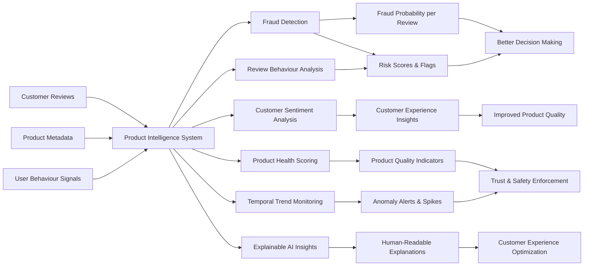
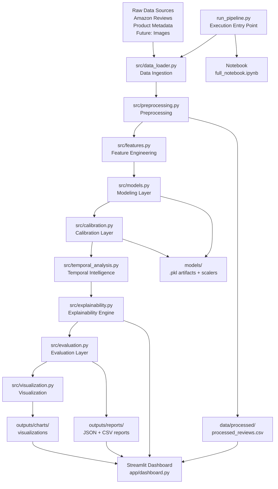

# Product Intelligence System (NLP | Machine Learning | Explainable AI)

## Overview

This project implements a complete end-to-end machine learning pipeline for analysing product reviews at scale, with a focus on fraud detection, behavioural intelligence, and explainable insights.

It is designed to replicate a **production-grade ML system**, combining natural language processing, anomaly detection, clustering, and temporal analytics into a unified modular architecture.

The system transforms raw review data into structured intelligence that can be used for monitoring trust, detecting manipulation, and understanding product performance.

---

## Business Context & Value

In modern e-commerce platforms, user-generated reviews directly influence purchasing decisions, product rankings, and platform trust.

However, review systems are vulnerable to:

- Fake or manipulated reviews
- Coordinated spam campaigns
- Sentiment distortion
- Behavioural anomalies

This project demonstrates how machine learning can be applied to:

- Detect fraudulent or suspicious reviews
- Monitor product trust and quality signals
- Identify behavioural patterns across users and products
- Support risk-based decision making
- Provide interpretable insights for moderation systems

---

## Key Analytical Capabilities

The system enables deep analysis across textual, behavioural, and temporal dimensions:

- Detection of **anomalous reviews using Isolation Forest**
- Identification of **semantic clusters of reviews using embeddings**
- Measurement of **sentiment vs rating inconsistencies**
- Detection of **outliers in linguistic and behavioural patterns**
- Generation of **fraud probability scores via calibration models**
- Analysis of **temporal spikes in review activity and fraud signals**
- Extraction of **cluster-level themes and insights**
- Product-level intelligence including **risk and quality scoring**

---


## System Overview (Business View)



## Pipeline Architecture (Technical)



---


## Folder Structure & Detailed Contents

product-intelligence-system/

│

├── data/                          # Raw and processed datasets

│   ├── raw/                       # Original input data

│   │   ├── amazon_reviews.csv

│   │   └── electronics_products.csv

│   │

│   └── processed/                 # Pipeline outputs (model-ready dataset)

│       └── processed_reviews.csv

│

├── notebooks/                     # Exploratory + narrative notebooks

│   └── full_notebook.ipynb        # End-to-end walkthrough (portfolio-facing)

│

├── src/                           # Core ML pipeline modules

│   │

│   ├── __init__.py

│   ├── utils.py                   # Logging, timers, IO utilities, persistence

│   │

│   ├── data_loader.py             # Data ingestion + schema standardisation

│   ├── preprocessing.py           # Text cleaning + normalization

│   ├── features.py                # Feature engineering (NLP + embeddings)

│   ├── models.py                  # Anomaly detection + clustering + risk scoring

│   ├── calibration.py             # Probability calibration (risk → fraud likelihood)

│   ├── explainability.py          # Review + cluster explainability

│   ├── temporal_analysis.py       # Time-series intelligence + anomaly detection

│   ├── evaluation.py              # Full evaluation + diagnostics suite

│   ├── visualization.py           # Static chart generation

│   │

│   └── pipeline.py                # End-to-end orchestration logic

│

├── run_pipeline.py                # Execution entry point (config-driven pipeline)

│

├── models/                        # Serialized trained models

│   ├── isolation_forest.pkl       # Anomaly detection model

│   ├── kmeans.pkl                 # Clustering model

│   ├── calibration_model.pkl      # Probability calibration model

│   ├── scaler.pkl                 # General feature scaler

│   ├── scaler_structured.pkl      # Structured feature scaler

│   ├── scaler_embeddings.pkl      # Embedding scaler

│   └── scaler_calibration.pkl     # Calibration scaler

│

├── outputs/

│   ├── charts/                   # Generated visualisations

│   │   ├── risk_distribution.png

│   │   └── cluster_distribution.png

│   │

│   └── reports/                  # Analytical outputs and diagnostics

│       ├── evaluation.json            # Model performance + system diagnostics

│       ├── temporal_analysis.json     # Time-based trends and anomaly signals

│       ├── cluster_explanations.json  # Cluster-level interpretability

│       ├── review_explanations.csv    # High-risk review explanations

│       └── feature_columns.json       # Feature schema for reproducibility

│

├── app/

│   └── dashboard.py              # Streamlit dashboard for exploration

│

├── config.yaml                   # Central configuration (paths, hyperparameters)

├── requirements.txt              # Dependencies

├── .gitignore                    # Exclusions (data, models, outputs)

└── README.md                     # Project documentation

---

## System Design

The architecture is modular and designed for extensibility and reproducibility:

- **data_loader** – schema standardisation, ID generation, timestamp handling 
- **preprocessing** – text cleaning, filtering, linguistic feature extraction 
- **features** – sentiment analysis, embeddings, feature matrix construction  
- **models** – anomaly detection, clustering, risk signal generation  
- **calibration** – conversion of risk signals into calibrated probabilities  
- **explainability** – human-readable explanations for reviews and clusters  
- **temporal_analysis** – time-based anomaly detection and drift analysis  
- **evaluation** – full ML diagnostics and performance analysis  
- **visualization** – generation of charts for reporting and dashboards  
- **pipeline** – orchestration of the full system  

---

## Data Model & Feature Design

The system constructs a rich feature space combining:

### Textual Features
- Cleaned review text
- Sentence embeddings (MiniLM)
- Sentiment scores (VADER)

### Behavioural Features
- Review length and word count
- Capitalisation patterns
- Punctuation density
- Exclamation usage

### Derived Features
- Sentiment-rating gap
- Length z-scores
- Word density metrics
- Cluster distance (semantic deviation)

### Risk Features
- Anomaly scores
- Behavioural inconsistencies
- Semantic outliers
- Linguistic anomalies

These features are fused into a **unified feature matrix** used for modeling and risk scoring.

---

## What This Project Demonstrates

### Machine Learning Engineering
- End-to-end pipeline design with modular components
- Integration of multiple ML models in a single system
- Feature fusion across structured and unstructured data
- Robust handling of real-world noisy datasets

### NLP & Representation Learning
- Sentiment analysis using VADER
- Semantic embeddings using Sentence Transformers
- Text preprocessing and linguistic feature extraction

### Anomaly Detection & Clustering
- Isolation Forest for unsupervised fraud detection
- KMeans clustering for semantic segmentation
- Distance-based outlier detection

### Explainable AI
- Review-level reasoning for flagged content
- Cluster-level interpretability (themes + behaviour)
- Transparent risk scoring logic

### Temporal Intelligence
- Detection of spikes in fraudulent activity
- Sentiment drift analysis over time
- Review velocity monitoring

### System Design
- Clean modular architecture
- Reproducibility via configuration
- Separation of pipeline stages
- Production-style code organisation

---

## Data Sources

This project uses large-scale **Amazon product review data** along with product metadata for building the product intelligence system.

Due to file size limitations, the datasets are **not included in this repository**.

---

## How to Reproduce

To run this project end-to-end:

1. Obtain a suitable Amazon reviews dataset (e.g. from Kaggle or public datasets)
2. Place the raw files into: `data/raw/`
3. Run the pipeline:

```bash
python run_pipeline.py
```

This will automatically:

- Clean and preprocess the data
- Generate features
- Train models
- Produce outputs in `data/processed/`, `data/models/`, and `data/outputs/`

## Expected Raw Files

Place the following files inside `data/raw/`:

| Filename | Description |
|----------|-------------|
| `amazon_reviews.csv` | Main dataset containing review text, ratings, and metadata. |
| `electronics_products.csv` | Product-level metadata (IDs, categories, attributes). |


## Processed Data

After running the pipeline, the following file will be generated, that should be placed in `data/processed/`:

| Filename | Description |
|----------|-------------|
| `processed_reviews.csv` | Fully processed dataset with engineered features, risk scores, clusters, and predictions. |

## Important Notes

- All datasets are excluded via `.gitignore` due to size constraints
- The full pipeline is **reproducible from raw data using the provided code**
- No manual preprocessing is required — everything is handled by the pipeline
- This mirrors real-world ML systems where data is stored externally and pipelines are used to regenerate outputs

---

## Scale & Performance

- Designed to handle large-scale review datasets
- Efficient feature computation and vectorised operations
- Embedding generation with batch processing
- Scalable architecture for extension to larger datasets
- Optimised for both experimentation and production-style workflows

---

## ML Engineering Highlights

- Feature fusion of structured + embedding vectors
- Stable risk scoring system with bounded outputs
- Calibration using logistic regression for probability estimation
- Separation of structured vs embedding scaling pipelines
- Robust handling of missing and degenerate data cases
- Defensive programming (schema checks, assertions, safeguards)

---

## Outputs

### Charts
- Risk score distribution
- Cluster distribution

### Reports

- `evaluation.json` – Model performance and diagnostics  
- `temporal_analysis.json` – Time-based insights (drift, spikes, trends)  
- `cluster_explanations.json` – Cluster-level summaries and themes  
- `review_explanations.csv` – Row-level explainability outputs  
- `feature_columns.json` – Feature schema for reproducibility  

---

## Dashboard

An interactive Streamlit dashboard is included for exploration:

Features:
- Risk filtering and exploration
- Cluster visualisation
- Sentiment vs risk analysis
- Temporal trend monitoring
- High-risk review inspection
- Product-level intelligence view

Run with:

```bash
streamlit run app/dashboard.py
